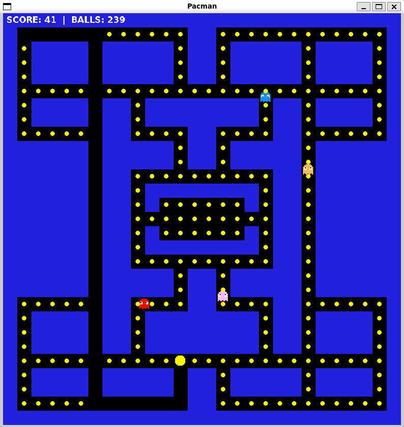
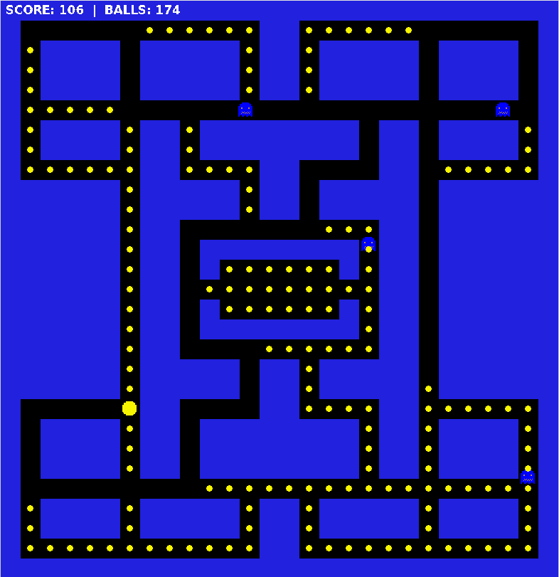
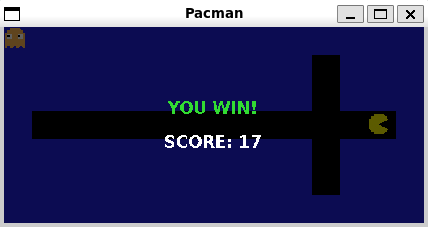
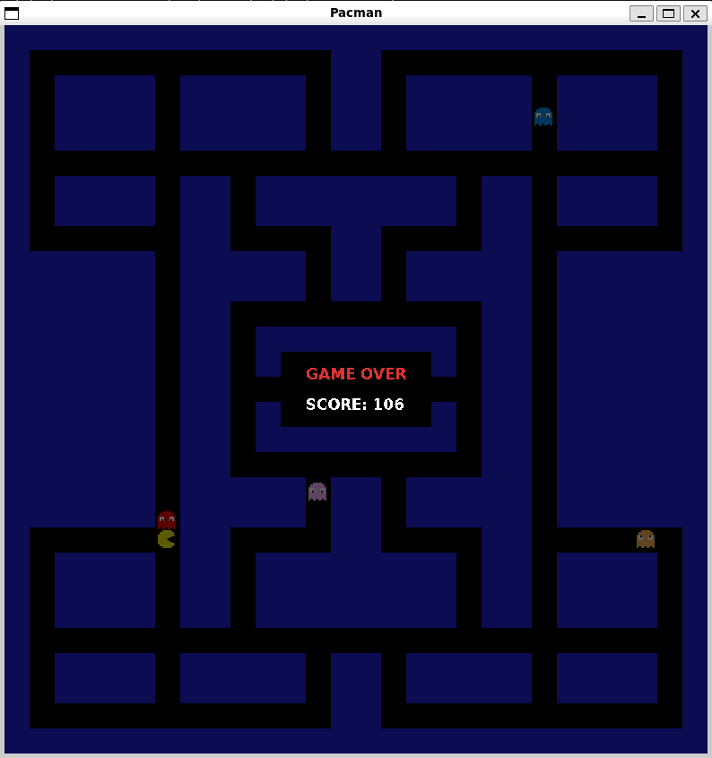

# Pac-Man in C

A Pac-Man clone written in C with SDL2, built as part of the ENSEIRB-MATMECA engineering curriculum.


## Screenshots







## Dependencies

```bash
sudo apt install libsdl2-dev libsdl2-image-dev libsdl2-ttf-dev
```

## Build & Run

```bash
make
./pacman              # default map
./pacman maps/map1    # custom map
```

## Controls

| Key | Action |
|-----|--------|
| `↑` / `W` | Move up |
| `↓` / `S` | Move down |
| `←` / `A` | Move left |
| `→` / `D` | Move right |
| `Q` | Quit |

## Features

**Gameplay**
- Eat every gomme on the map to win
- Touch a ghost in normal mode → game over
- Eat enough gommes to trigger vulnerable mode: ghosts flee and can be eaten
- Eaten ghosts travel back to the ghost house as eyes, then respawn as normal ghosts

**Ghost AI**
- 4 ghosts with distinct behaviours:
  - **Pink** — predictive chase (targets 4 tiles ahead of Pac-Man)
  - **Red** — direct chase
  - **Blue / Orange** — random movement
- Ghosts flicker (blue ↔ white) in the last 2 seconds of vulnerable mode
- Ghost speed scales dynamically as you eat more gommes:

| Gommes eaten | Normal speed | Vulnerable speed |
|---|---|---|
| 0 – 50% | 1.0 | 0.6 |
| 50 – 65% | 1.1 | 0.6 |
| 65 – 80% | 1.2 | 0.6 |
| 80 – 100% | 1.4 | 0.6 |

**Technical**
- Float speed accumulator for smooth sub-pixel movement
- Cached SDL2_ttf HUD textures (rebuilt only on score change)
- Custom 32×32 pixel art sprites (24 total, copyright-free)
- Custom maps via command-line argument (see map format below)

## Project Structure

```
Pacman-in-C/
├── src/
│   ├── main.c      # SDL init, game loop, rendering, HUD
│   ├── ghost.c/h   # Ghost AI, vulnerable/flicker/eyes/respawn
│   ├── map.c/h     # Map loading and tile types
│   └── utils.c/h   # Movement, collision, float accumulator
├── images/         # Custom pixel art sprites (PNG)
├── maps/           # Map files
└── Makefile
```

## Map Format

Maps are plain text files. Each character is one tile:

| Char | Meaning |
|------|---------|
| `W` | Wall |
| ` ` (space) | Path |
| `S` | Pac-Man start |
| `G` | Ghost (up to 4, assigned pink→red→blue→orange in order) |